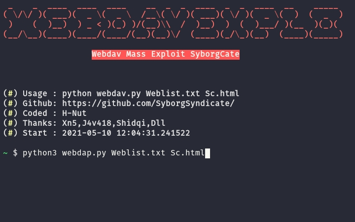
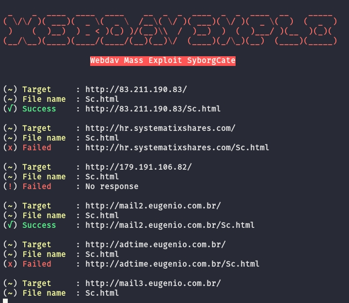

# WebdavExplo
WebDAV is a protocol that allows us to open a web server directory locally, so that it will appear as a local directory. It is important that the remote computer runs the WebDAV server

### Usage ✨
<p align="center">
  <a name="top" href="#octocat-hi-there-thanks-for-visiting-">
     
  </a>
</p>

### Results 🚀
<p align="center">
  <a name="top" href="#octocat-hi-there-thanks-for-visiting-">
     
  </a>
</p>

# Installation 💢
<details open>
<summary> Android / Linux</summary>

- ```bash
  $ apt update && apt upgrade
  ```

- ```bash
  $ apt install python2 git -y
  ```
- ```bash
  $ apt install pip 
  ```
- ```bash
  $ pip install requests
  ```

- ```bash
  $ git clone https://github.com/SyborgSyndicate/WebdavExplo
  ```

- ```bash
  $ cd WebdavExplo
  ```

- ```bash
  $ python3 webdap.py 
  ```
- ```bash
  $ Python3 webdap.py Weblist.txt Sc.html
